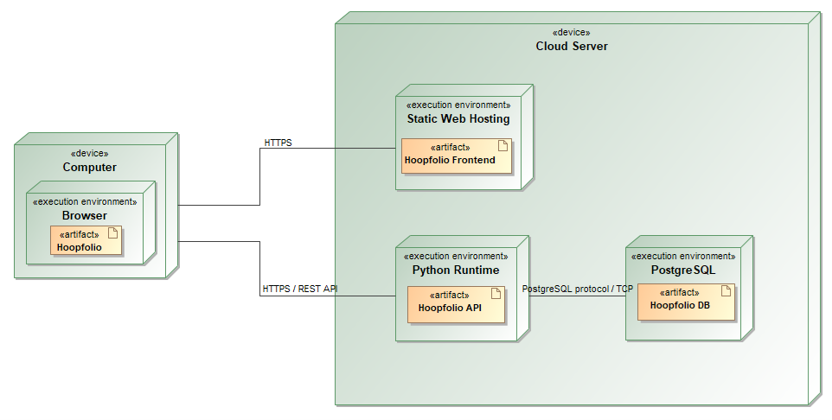

# Hoopfolio

**Krepšinio žaidėjų ir komandų skautavimo platforma**

Kauno technologijos universitetas  
Informatikos fakultetas  
Taikomosios informatikos katedra  
T120B165 Saityno taikomųjų programų projektavimas

**Darbo autorius:** Mantas Gaižutis

## 1. Sprendžiamo uždavinio aprašymas

### 1.1. Sistemos paskirtis

Projekto tikslas – palengvinti krepšinio žaidėjų ir komandų skautavimą bei padėti priimti sprendimus remiantis statistika ir skautų vertinimais.

Kuriama platforma bus skirta krepšinio klubų darbuotojams, treneriams, skautams, žaidėjams bei jų atstovams. Naudotojai galės peržiūrėti žaidėjų ir komandų profilius, jų statistiką, kurti stebėjimo sąrašus bei rengti skautavimo ataskaitas. Klubai galės stebėti potencialius komandos papildymus ir analizuoti varžovų sudėtis bei statistinius rodiklius, o žaidėjai ir jų atstovai – vertinti skirtingas komandas, jų sudėtis bei žaidimo stilių.

Pagrindiniai sistemos objektai bus stebėjimo sąrašas, stebimas objektas ir skautavimo ataskaita. Stebimas objektas – tai konkretaus žaidėjo arba komandos įtraukimas į stebėjimo sąrašą. Tas pats žaidėjas ar komanda galės būti įtraukti į kelis skirtingus sąrašus. Stebėjimo sąrašuose bus kaupiami dominantys žaidėjai arba komandos. Kiekvienas į sąrašą įtrauktas objektas turės savo stebėjimo būseną ir prioritetą, kuriuos galės nustatyti sąrašo autorius, o prie jo bus galima pridėti ir peržiūrėti skirtingų naudotojų ataskaitas su pastebėjimais, vertinimais ir išvadomis. Naudotojai galės suteikti kitiems prieigą prie savo sąrašų ir juose esančių ataskaitų bei kartu stebėti žaidėjus ar komandas. Kiekvienam stebėjimo sąrašui bus galima nurodyti jo tikslą ar poreikį (pvz. konkrečią poziciją, kurią norima papildyti, ar sezoną, kuriam ieškoma sprendimo), o tai leis analitikui palyginti sąraše esančius stebimus objektus tarpusavyje pagal jiems skirtus skautų vertinimus ir priimti tinkamą sprendimą.

### 1.2. Funkciniai reikalavimai

Sistemoje numatytos trys registruotų naudotojų rolės: skaitytojas, analitikas ir administratorius.

**Neregistruotas naudotojas galės:**

1. Peržiūrėti žaidėjų ir komandų sąrašus, atlikti paiešką ir filtruoti rezultatus.
2. Peržiūrėti žaidėjų ir komandų profilius, komandų sudėtis bei bendrus statistinius rodiklius.
3. Palyginti pasirinktų žaidėjų arba komandų statistinius rodiklius.
4. Užsiregistruoti ir prisijungti prie sistemos.

**Skaitytojas papildomai galės:**

1. Peržiūrėti jam bendrinamus stebėjimo sąrašus ir jų informaciją.
2. Peržiūrėti sąrašų stebimus objektus ir jų skautavimo ataskaitas.
3. Peržiūrėti stebimo objekto skautų įvertinimų suvestinę.
4. Palyginti sąraše esančius stebimus objektus tarpusavyje pagal jų skautų vertinimus.
5. Atsijungti nuo sistemos.

**Analitikas galės naudotis skaitytojo funkcijomis ir papildomai:**

1. Kurti, peržiūrėti, redaguoti ir trinti savo stebėjimo sąrašus, nurodant jų tikslą (pvz. ieškomą poziciją ar sezoną).
2. Bendrinti sąrašus su kitais naudotojais ir valdyti jų prieigos teises.
3. Įtraukti žaidėjus arba komandas į sąrašus, peržiūrėti stebimus objektus, keisti jų būseną, prioritetą ir stebėjimo kontekstą bei pašalinti juos iš sąrašo.
4. Kurti, peržiūrėti, redaguoti ir trinti savo skautavimo ataskaitas. Ataskaitoje nurodyti stebėjimo datą, stiprybes, silpnybes, įžvalgas, išvadas ir prireikus statistinius argumentus.
5. Ataskaitose skirti balus pagal nustatytus žaidėjų arba komandų vertinimo kriterijus.
6. Filtruoti stebėjimo sąrašus, stebimus objektus ir ataskaitas.

Skaitytojui bus suteikiama tik peržiūros teisė. Analitikas arba administratorius galės redaguoti bendrinamo sąrašo turinį tik gavęs atitinkamą prieigą.

**Administratorius galės naudotis analitiko funkcijomis ir papildomai:**

1. Pridėti ir taisyti žaidėjų bei komandų profilius ir komandų sudėtis.
2. Įvesti ir atnaujinti bendrus žaidėjų bei komandų statistinius rodiklius.
3. Peržiūrėti naudotojų sąrašą ir keisti jų roles.

## 2. Sistemos architektūra

Sistemos sudedamosios dalys:

- Kliento pusė (angl. Front-End) – React ir TypeScript; kūrimui ir programos surinkimui bus naudojamas Vite;
- Serverio pusė (angl. Back-End) – Python ir FastAPI;
- Duomenų bazė – PostgreSQL.

Kliento pusė bus skirta naudotojo sąsajai, o serverio pusė – sistemos veikimo logikai, duomenų tvarkymui, autentifikacijai ir prieigos teisių tikrinimui. Duomenų bazei pasiekti bus naudojama SQLAlchemy ORM biblioteka.

Sistemos talpinimui bus naudojamos debesų paslaugos. Naudotojai aplikaciją pasieks per interneto naršyklę, o kliento pusė per HTTPS protokolą bendraus su serverio API. Serveris vykdys duomenų mainus su PostgreSQL duomenų baze.

*1 pav. Numatoma sistemos diegimo diagrama.*
